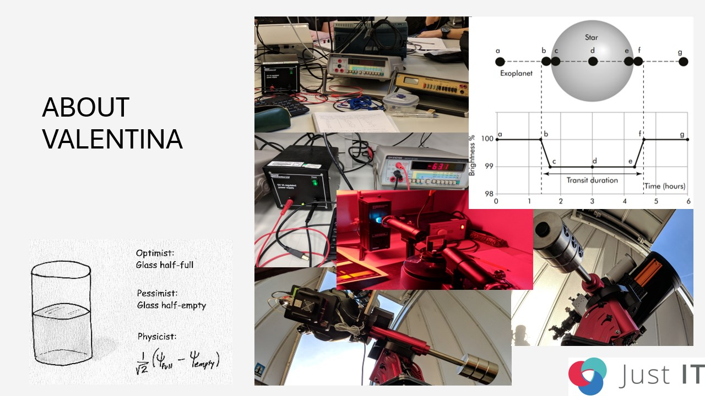
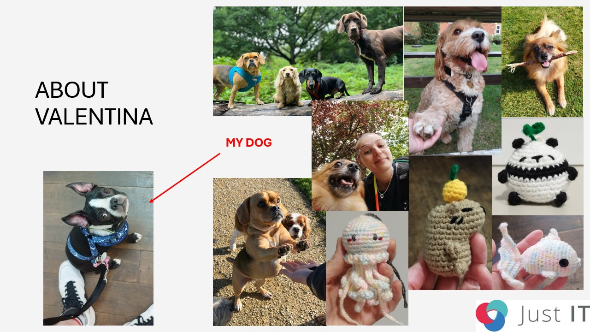
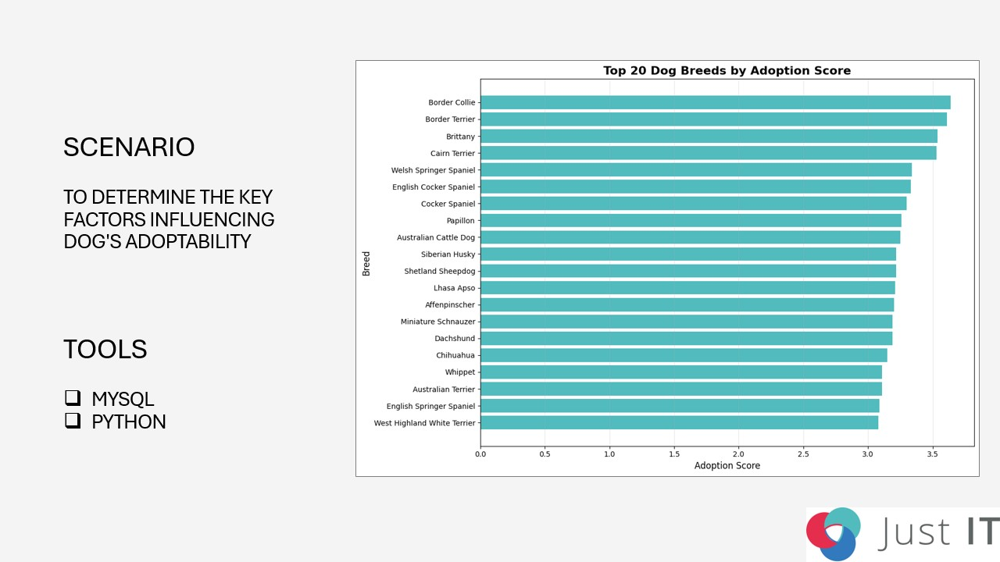
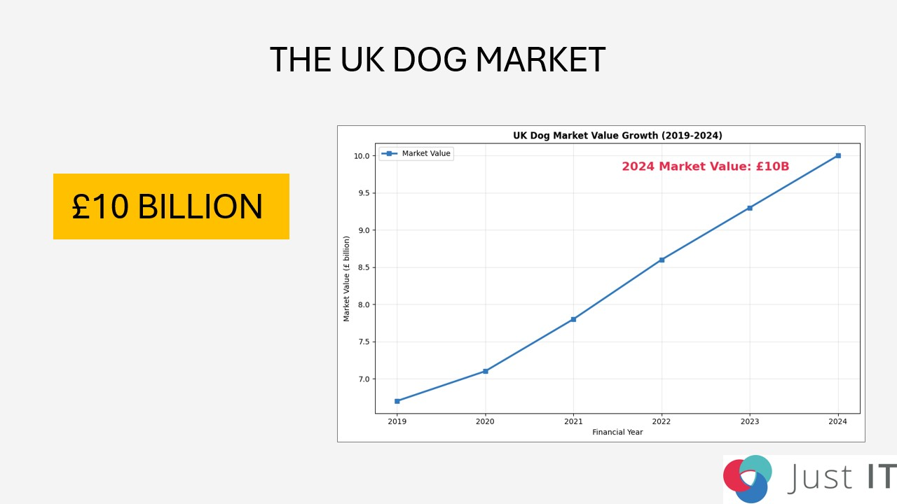
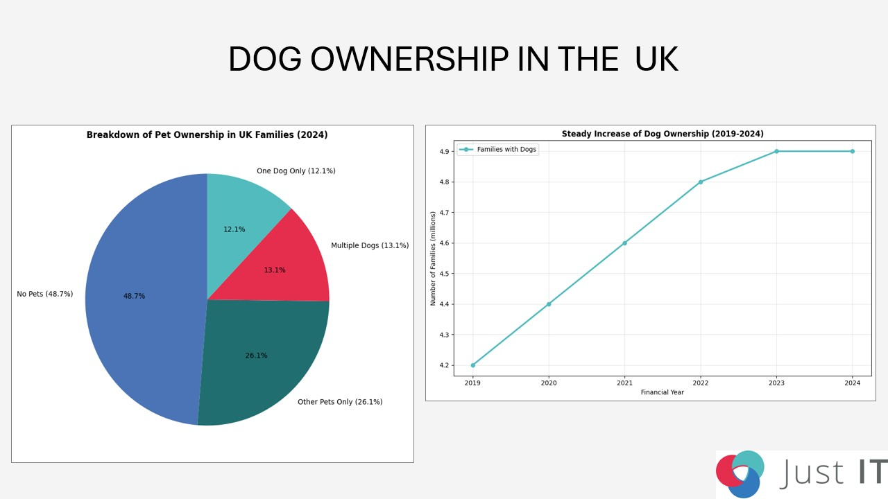
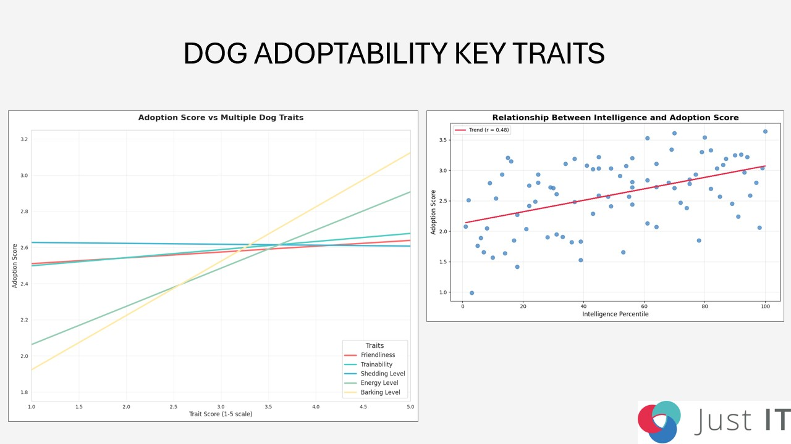
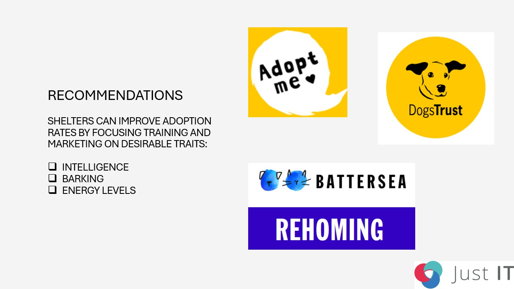

# Just IT Graduation - Slides & Script

Hi, I'm Valentina, and I'm based in London. I hold a Master’s in Astrophysics from Queen Mary University and my dissertation was about planet hunting with Python.  
I worked on an enormous dataset from NASA, to find planets outside our solar system.  
To give you an idea, it was like working on a giant "Where's Waldo?".  
When I eventually found a new planet it felt like I had also discovered my superpower.  
It may sound nerdish, but that feeling of finding hidden patterns is what I want my career to be about!  
This is when I learnt that I'm a naturally very methodical person and that my key strengths are problem solving and finding patterns.  
That's also what led me to the Data Analyst Bootcamp at Just IT.  
In terms of my professional experience, I started as a Data Science Intern, analysing satellite data for environmental research, I then progressed to a role as a Data Engineer at Quantexa, where I gained exposure to working with big data. 
 

I currently run my own Dog Sitting business, a role that has given me a strong set of transferable skills.  
And that brings me to my hobbies.  
Dog training, which has taught me about being consistent, about patience, trust, communication and breaking a big challenge into small, successful steps.  
I also make little plush toys with a Japanese technique called Amigurumi which is about precision and details. 
   

I will now walk you through a project which I developed using Python and SQL.  
As you can see from this slide, my project focuses on determining what key factors influence a dog's adoptability.  
This is meant to aid dog shelters and breeders alike.  
But before I start, I will talk you through some choices I made which will likely show you who I am as a professional.  
My philosophy is that a data analyst's main job is to tell a clear story with the data.  
So, I'm going to focus on the insights I found in the data and I'll leave the technical methodology in the background.  
I will also mainly rely on the simplicity and clarity of images for my slides. 
 

Now, let’s get started with some Statistics!  
According to the Office for National Statistics, the UK dog market is estimated at approximately £10 billion in 2024 and steadily growing since 2019. 
 

Here, looking at the pie chart, we can see that in 2024 just over half of UK families own pets, and about 1 in 4 families owns one or more dogs.  
On the right, the line graph shows a steady upward trend in dog ownership: the number of families with dogs has grown consistently from just over 4.2 million in 2019 to nearly 4.9 million in 2024. 
 

Here, the first chart reveals that dogs with higher adoption scores tend to be very friendly and trainable.  
They also tend to have lower shedding and barking levels.  
The scatter plot on the right shows a positive, moderate relationship between a dog's intelligence and its adoption score.  
This suggests that as intelligence increases, we generally see a corresponding increase in a dog's chances of being adopted. 
 

In conclusion, the data indicates that shelters can improve adoption rates by focusing training and marketing on key desirable traits, particularly a dog's trainability and barking level.  
For breeders, a focus on selectively breeding for intelligence and a calmer disposition would better align their dogs with what adopters are seeking. 
 

And that brings me to the end of my presentation.  
Thank you for your attention.  
A link to my portfolio and contact details can be found in the chat.  
A special thanks to my trainers Anna, Sebastien, Leigh and Christian who provided incredible support and shared their invaluable expertise with us. 
 

Contact me [My linktree](https://linktr.ee/valentina_data)

